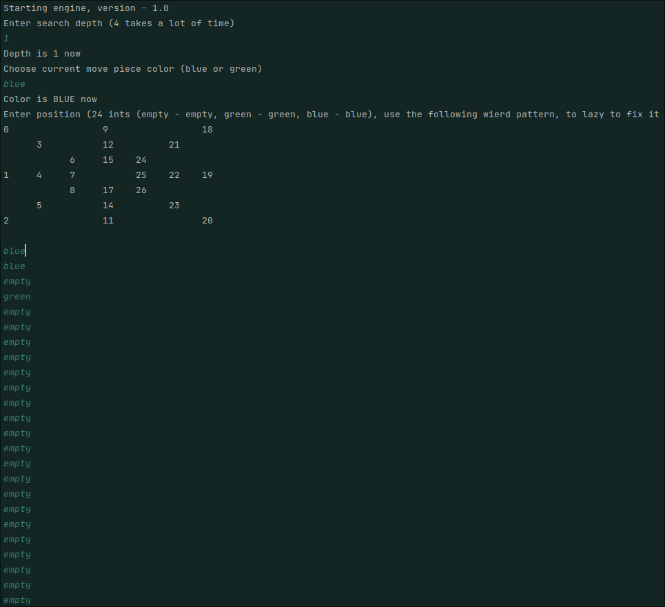
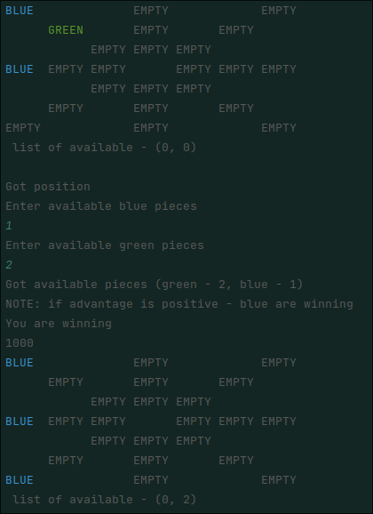

This project is engine for "nine men's morris" game, written in kotlin.
It has no ui yet, so you console.
Max depth with okay speed is 4 (prob. week pc), so I am going to omptimise it (in case I continue working on this)

Preview:

0-----------------1-----------------2 
|                 |                 |
|     3-----------4-----------5     |
|     |           |           |     |
|     |     6-----7-----8     |     |
|     |     |           |     |     |
9-----10----11          12----13----14
|     |     |           |     |     |
|     |     15----16----17    |     |
|     |           |           |     |
|     18----------19----------20    |
|                 |                 |
21----------------22----------------23
